# DinoAir Enhanced API Architecture & Flow Diagram

## Complete API Request Flow with Detailed Middleware

```mermaid
graph TB
    %% Frontend Layer
    subgraph "Frontend Layer (React - Port 5173)"
        subgraph "Pages"
            HP[HomePage]
            CP[ChatPage]
            TP[ToolsPage]
            PP[ProjectsPage]
            FP[FilesPage]
            NP[NotesPage]
            SP[SettingsPage]
        end

        subgraph "UI Components"
            Button[Button Components]
            SearchInput[Search Input]
            Card[Card Components]
            Table[Table Components]
        end

        subgraph "React Hooks"
            useAnnouncement[useAnnouncement]
            useResponsive[useResponsive]
            useState[Component State]
        end
    end

    %% API Communication Layer
    subgraph "API Communication Layer"
        subgraph "Core API Library (src/lib/api)"
            APICore["API Core<br/>• request() function<br/>• Base URL: :24801<br/>• Error handling"]
            APIHealth["Health API<br/>• getHealth()"]
            APIChat["Chat API<br/>• sendChatMessage()"]
        end

        subgraph "Specialized APIs"
            RagAPI["RAG API<br/>• ingestDirectory()<br/>• ingestFiles()<br/>• context()<br/>• Vector operations"]
            SearchAPI["Search API<br/>• keywordSearch()<br/>• vectorSearch()<br/>• File indexing"]
            TranslateAPI["Translate API<br/>• Code translation<br/>• Language processing"]
        end

        subgraph "Service Abstractions (src/services)"
            CoreSvc["core.ts<br/>• getCurrentTime()<br/>• listDirectory()<br/>• addTwoNumbers()"]
            NotesSvc["notes.ts<br/>• listAllNotes()<br/>• searchNotes()<br/>• createNote()"]
            ProjectsSvc["projects.ts<br/>• listAll()<br/>• search()<br/>• getStats()"]
        end
    end

    %% Network Transport
    subgraph "Network Transport"
        HTTP["HTTP/HTTPS<br/>• Cross-origin requests<br/>• JSON payloads<br/>• Auth headers"]
    end

    %% CORS Layer
    subgraph "CORS Layer"
        CORS["CORSMiddleware<br/>• Origins: Frontend<br/>• Methods: GET,POST,PUT,PATCH<br/>• Headers: Content-Type, X-DinoAir-Auth<br/>• X-Request-ID, X-Trace-Id<br/>• Expose: X-Trace-Id<br/>• Max-Age: 600s"]
    end

    %% Middleware Stack (Applied in reverse order)
    subgraph "Middleware Pipeline (Sequential Processing)"
        direction TB

        subgraph "1. Request ID (Outermost)"
            RequestID["RequestIDMiddleware<br/>• Generates UUID trace_id<br/>• Adds X-Trace-Id header<br/>• Scope['trace_id'] available<br/>• Per-request tracking"]
        end

        subgraph "2. Compression"
            GZip["GZipMiddleware<br/>• Response compression<br/>• Min size: 1024 bytes<br/>• Reduces payload size"]
        end

        subgraph "3. Request/Response Logging"
            ReqResLogger["RequestResponseLogger<br/>• Structured logging<br/>• Request/response details<br/>• Performance metrics<br/>• Error correlation"]
        end

        subgraph "4. Timeout Protection"
            Timeout["TimeoutMiddleware<br/>• Max: 30 seconds (configurable)<br/>• Returns 504 on timeout<br/>• Uses anyio.move_on_after<br/>• Prevents hanging requests"]
        end

        subgraph "5. Authentication"
            Auth["AuthMiddleware<br/>• X-DinoAir-Auth header<br/>• HMAC constant-time comparison<br/>• Skips: /health, /docs (dev only)<br/>• Returns 401 on failure"]
        end

        subgraph "6. Body Size Limit"
            BodyLimit["BodySizeLimitMiddleware<br/>• Max: 10MB (configurable)<br/>• Content-Length validation<br/>• Body streaming check<br/>• Returns 413 when exceeded<br/>• Applies to POST/PUT/PATCH"]
        end

        subgraph "7. Content Type Validation"
            ContentType["ContentTypeJSONMiddleware<br/>• Enforces JSON for POST requests<br/>• Returns 415 for invalid types<br/>• Content-Type validation"]
        end
    end

    %% FastAPI Application
    subgraph "FastAPI Application (Port 24801)"
        App["FastAPI App<br/>• Title: DinoAir Local API<br/>• Version: 0.1.0<br/>• OpenAPI docs (dev only)<br/>• ORJSON responses"]

        subgraph "Exception Handling"
            ErrorHandler["Unified Exception Handlers<br/>• ErrorResponse format<br/>• HTTP status mapping<br/>• Trace ID correlation<br/>• Structured error details"]
        end

        subgraph "Route Handlers"
            HealthRoute["/health<br/>• System status<br/>• Always public<br/>• No auth required"]
            ChatRoute["/chat<br/>• AI conversations<br/>• LM Studio integration<br/>• Message processing"]
            RagRoute["/rag/*<br/>• Document ingestion<br/>• Context retrieval<br/>• Vector operations<br/>• File processing"]
            SearchRoute["/search/*<br/>• Keyword search<br/>• Vector similarity<br/>• File indexing<br/>• Result ranking"]
            TranslateRoute["/translate<br/>• Code translation<br/>• Language processing<br/>• Auth required"]
            MetricsRoute["/metrics<br/>• System metrics<br/>• Performance data<br/>• Health statistics"]
            ConfigRoute["/config<br/>• Configuration management<br/>• Settings retrieval"]
            ToolsRoute["/tools/*<br/>• Tool execution<br/>• Schema generation<br/>• External integrations"]
            RouterRoute["/router/*<br/>• Service routing<br/>• Load balancing<br/>• Service discovery"]
        end
    end

    %% Backend Services
    subgraph "Backend Services Layer"
        subgraph "Core Infrastructure"
            RouterClient["router_client.py<br/>• Service discovery<br/>• Load balancing<br/>• Health checks<br/>• Failover logic"]
            Settings["settings.py<br/>• Environment config<br/>• DINOAIR_* variables<br/>• Feature flags<br/>• Timeouts & limits"]
        end

        subgraph "RAG & Search Services"
            RagIngestion["rag_ingestion.py<br/>• Document processing<br/>• Text extraction<br/>• Chunk management<br/>• Metadata handling"]
            RagContext["rag_context.py<br/>• Context retrieval<br/>• Relevance scoring<br/>• Query processing<br/>• Result ranking"]
            RagEmbeddings["rag_embeddings.py<br/>• Vector generation<br/>• Embedding models<br/>• Similarity computation<br/>• Index management"]
            SearchSvc["search.py<br/>• Search operations<br/>• Index management<br/>• Query optimization<br/>• Result filtering"]
        end

        subgraph "Utility Services"
            Translator["translator.py<br/>• Code translation<br/>• Language detection<br/>• Syntax validation<br/>• Output formatting"]
            ToolRegistry["tool_schema_generator.py<br/>• Tool discovery<br/>• Schema validation<br/>• API documentation<br/>• Tool execution"]
        end
    end

    %% External Services
    subgraph "External Services & Storage"
        LMStudio["LM Studio Server<br/>• Local LLM inference<br/>• Model management<br/>• Chat completions<br/>• Token usage tracking"]
        VectorDB["Vector Database<br/>• Embedding storage<br/>• Similarity search<br/>• Index management<br/>• Query optimization"]
        FileSystem["File System<br/>• Document storage<br/>• Index files<br/>• Configuration files<br/>• Log files"]
        Database["Database Layer<br/>• Application data<br/>• User preferences<br/>• Search indexes<br/>• Metrics storage"]
    end

    %% Request Flow Connections
    %% Frontend to API
    HP --> APICore
    CP --> APICore
    TP --> APICore
    PP --> APICore
    FP --> APICore
    NP --> APICore
    SP --> APICore

    %% API to Services
    APICore --> CoreSvc
    APICore --> NotesSvc
    APICore --> ProjectsSvc
    APICore --> RagAPI
    APICore --> SearchAPI
    APICore --> TranslateAPI

    %% Services to HTTP
    CoreSvc --> HTTP
    NotesSvc --> HTTP
    ProjectsSvc --> HTTP
    RagAPI --> HTTP
    SearchAPI --> HTTP
    TranslateAPI --> HTTP
    APIHealth --> HTTP
    APIChat --> HTTP

    %% Through CORS
    HTTP --> CORS

    %% Through Middleware Pipeline (Sequential)
    CORS --> RequestID
    RequestID --> GZip
    GZip --> ReqResLogger
    ReqResLogger --> Timeout
    Timeout --> Auth
    Auth --> BodyLimit
    BodyLimit --> ContentType

    %% To FastAPI App
    ContentType --> App

    %% Exception Handling
    App --> ErrorHandler

    %% Route Distribution
    App --> HealthRoute
    App --> ChatRoute
    App --> RagRoute
    App --> SearchRoute
    App --> TranslateRoute
    App --> MetricsRoute
    App --> ConfigRoute
    App --> ToolsRoute
    App --> RouterRoute

    %% Backend Service Integration
    RagRoute --> RouterClient
    SearchRoute --> RouterClient
    TranslateRoute --> RouterClient
    MetricsRoute --> RouterClient
    RouterRoute --> RouterClient
    ToolsRoute --> RouterClient

    RouterClient --> Settings

    %% Service Specialization
    RagRoute --> RagIngestion
    RagRoute --> RagContext
    RagRoute --> RagEmbeddings
    SearchRoute --> SearchSvc
    TranslateRoute --> Translator
    ToolsRoute --> ToolRegistry

    %% External Service Connections
    ChatRoute --> LMStudio
    RagEmbeddings --> VectorDB
    RagContext --> VectorDB
    SearchSvc --> VectorDB
    RagIngestion --> FileSystem
    RouterClient --> Database
    Settings --> FileSystem

    %% Styling
    classDef frontend fill:#e1f5fe,stroke:#01579b,stroke-width:2px
    classDef api fill:#f3e5f5,stroke:#4a148c,stroke-width:2px
    classDef service fill:#e8f5e8,stroke:#1b5e20,stroke-width:2px
    classDef network fill:#fff3e0,stroke:#e65100,stroke-width:2px
    classDef middleware fill:#fff3e0,stroke:#ff6f00,stroke-width:2px
    classDef backend fill:#fce4ec,stroke:#880e4f,stroke-width:2px
    classDef external fill:#f1f8e9,stroke:#33691e,stroke-width:2px
    classDef cors fill:#e0f2f1,stroke:#00695c,stroke-width:2px

    class HP,CP,TP,PP,FP,NP,SP,Button,SearchInput,Card,Table,useAnnouncement,useResponsive,useState frontend
    class APICore,APIHealth,APIChat,RagAPI,SearchAPI,TranslateAPI api
    class CoreSvc,NotesSvc,ProjectsSvc service
    class HTTP network
    class CORS cors
    class RequestID,GZip,ReqResLogger,Timeout,Auth,BodyLimit,ContentType middleware
    class App,HealthRoute,ChatRoute,RagRoute,SearchRoute,TranslateRoute,MetricsRoute,ConfigRoute,ToolsRoute,RouterRoute,ErrorHandler backend
    class RouterClient,Settings,RagIngestion,RagContext,RagEmbeddings,SearchSvc,Translator,ToolRegistry backend
    class LMStudio,VectorDB,FileSystem,Database external
```



## Detailed Middleware Flow Analysis

### 1. Request ID Middleware (Outermost Layer)

```python
class RequestIDMiddleware:
    # Generates UUID trace_id for each request
    # Adds X-Trace-Id to response headers
    # Makes trace_id available in scope["trace_id"]
    # Enables request tracking across entire pipeline
```

**Purpose**: Request correlation and distributed tracing
**Headers Added**: `X-Trace-Id`
**Scope Enhancement**: `scope["trace_id"]`

### 2. GZip Compression Middleware

```python
from starlette.middleware.gzip import GZipMiddleware
app.add_middleware(GZipMiddleware, minimum_size=1024)
```

**Purpose**: Response compression for bandwidth optimization
**Minimum Size**: 1024 bytes
**Benefit**: Reduces response payload sizes

### 3. Request/Response Logger Middleware

```python
from .logging_config import RequestResponseLoggerMiddleware
```

**Purpose**: Structured logging of all HTTP transactions
**Features**:

- Request/response details capture
- Performance metrics collection
- Error correlation with trace IDs
- Structured log format

### 4. Timeout Middleware

```python
class TimeoutMiddleware:
    def __init__(self, app: ASGIApp, timeout_seconds: int):
        self.timeout_seconds = max(1, timeout_seconds)  # Default: 30s

    async def __call__(self, scope, receive, send):
        with move_on_after(self.timeout_seconds) as cancel_scope:
            await self.app(scope, receive, send)
        if cancel_scope.cancel_called:
            return await self._send_timeout(scope, receive, send)  # 504 response
```

**Purpose**: Prevents hanging requests
**Default Timeout**: 30 seconds (configurable via `DINOAIR_REQUEST_TIMEOUT_SECONDS`)
**Error Response**: HTTP 504 Gateway Timeout

### 5. Authentication Middleware

```python
class AuthMiddleware:
    async def __call__(self, scope, receive, send):
        # Skips auth for: GET /health, /docs (dev only), /openapi.json (dev only)
        provided = get_header(scope, "x-dinoair-auth")
        expected = self.settings.auth_token or ""
        if not hmac.compare_digest(provided or "", expected):
            # Return 401 Unauthorized
```

**Purpose**: Token-based authentication
**Header Required**: `X-DinoAir-Auth`
**Security**: HMAC constant-time comparison (prevents timing attacks)
**Public Endpoints**: `/health`, `/docs` (dev only), `/openapi.json` (dev only)
**Error Response**: HTTP 401 Unauthorized

### 6. Body Size Limit Middleware

```python
class BodySizeLimitMiddleware:
    def __init__(self, app: ASGIApp, settings: Settings):
        # Default: 10MB (configurable via DINOAIR_MAX_REQUEST_BODY_BYTES)

    async def __call__(self, scope, receive, send):
        # Applies to POST, PUT, PATCH methods only
        # Checks Content-Length header first
        # If no header, drains body up to limit
        # Returns 413 if exceeded
```

**Purpose**: Prevents resource exhaustion from large uploads
**Default Limit**: 10MB (10,485,760 bytes)
**Applicable Methods**: POST, PUT, PATCH
**Validation**: Content-Length header + body streaming
**Error Response**: HTTP 413 Request Entity Too Large

### 7. Content Type JSON Middleware (Innermost)

```python
class ContentTypeJSONMiddleware:
    async def __call__(self, scope, receive, send):
        # Enforces JSON content-type for POST requests
        # Returns 415 for invalid content types
```

**Purpose**: Ensures proper JSON payload format
**Applicable Methods**: POST requests
**Required Header**: `Content-Type: application/json`
**Error Response**: HTTP 415 Unsupported Media Type

## CORS Configuration Details

```python
app.add_middleware(
    CORSMiddleware,
    allow_origins=settings.allowed_origins,  # Frontend origin
    allow_methods=["GET", "POST", "OPTIONS", "PUT", "PATCH"],
    allow_headers=[
        "Content-Type",
        "X-DinoAir-Auth",
        "X-Request-ID",
        "X-Trace-Id"
    ],
    expose_headers=["X-Trace-Id"],  # Visible to frontend
    allow_credentials=False,
    max_age=600,  # 10 minutes preflight cache
)
```

## API Endpoint Security Matrix

| Endpoint        | Auth Required | Methods   | Body Limit | Content-Type | Timeout |
| --------------- | ------------- | --------- | ---------- | ------------ | ------- |
| `/health`       | ❌ No         | GET       | N/A        | N/A          | 30s     |
| `/chat`         | ✅ Yes        | POST      | 10MB       | JSON         | 30s     |
| `/rag/*`        | ✅ Yes        | POST, GET | 10MB       | JSON         | 30s     |
| `/search/*`     | ✅ Yes        | POST, GET | 10MB       | JSON         | 30s     |
| `/translate`    | ✅ Yes        | POST      | 10MB       | JSON         | 30s     |
| `/metrics`      | ✅ Yes        | GET       | N/A        | N/A          | 30s     |
| `/config`       | ✅ Yes        | GET, POST | 10MB       | JSON         | 30s     |
| `/tools/*`      | ✅ Yes        | POST, GET | 10MB       | JSON         | 30s     |
| `/router/*`     | ✅ Yes        | All       | 10MB       | JSON         | 30s     |
| `/docs`         | ❌ Dev Only   | GET       | N/A        | N/A          | 30s     |
| `/openapi.json` | ❌ Dev Only   | GET       | N/A        | N/A          | 30s     |

## Example Request Flow

### Chat Message Request Flow

```
1. ChatPage.tsx → sendChatMessage()
2. lib/api.request() → HTTP POST to :24801/chat
3. CORS Check → Allow origin, methods, headers
4. RequestID → Generate trace_id, add X-Trace-Id
5. GZip → (Response compression, not request)
6. Logger → Log request details with trace_id
7. Timeout → Start 30s timeout timer
8. Auth → Validate X-DinoAir-Auth header
9. BodyLimit → Check Content-Length ≤ 10MB
10. ContentType → Verify application/json
11. FastAPI App → Route to /chat handler
12. Chat Route → Process message with LM Studio
13. Response Pipeline → Add headers, compress, log
14. Frontend → Receive response with X-Trace-Id
```

### Error Response Example

```json
{
  "detail": "Missing or invalid authentication header.",
  "code": "ERR_UNAUTHORIZED",
  "message": "Missing or invalid authentication header.",
  "error": "Unauthorized"
}
```

## Performance Characteristics

### Request Processing Time

- **Middleware Overhead**: ~1-2ms per request
- **Auth Validation**: ~0.1ms (HMAC comparison)
- **Body Limit Check**: ~0.1ms (header check) or ~10ms (body drain)
- **Logging**: ~0.5ms (structured logging)
- **Total Middleware**: ~2-3ms typical overhead

### Memory Usage

- **Body Buffering**: Up to 10MB per request (for limit validation)
- **Request Tracking**: ~100 bytes per request (trace_id)
- **Logging Buffer**: ~1KB per request (structured logs)

### Security Guarantees

- **Auth**: Constant-time comparison prevents timing attacks
- **CORS**: Strict origin validation, no wildcards
- **Body Limits**: Prevents memory exhaustion
- **Timeouts**: Prevents resource starvation
- **Request Tracking**: Full audit trail via trace IDs

This enhanced architecture diagram provides complete visibility into your DinoAir API's security, performance, and reliability features through its comprehensive middleware pipeline.
