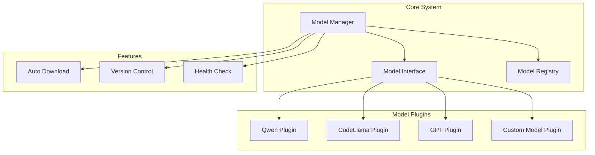
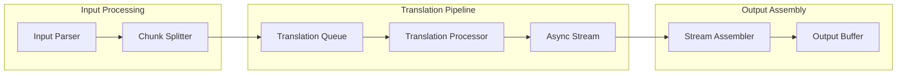
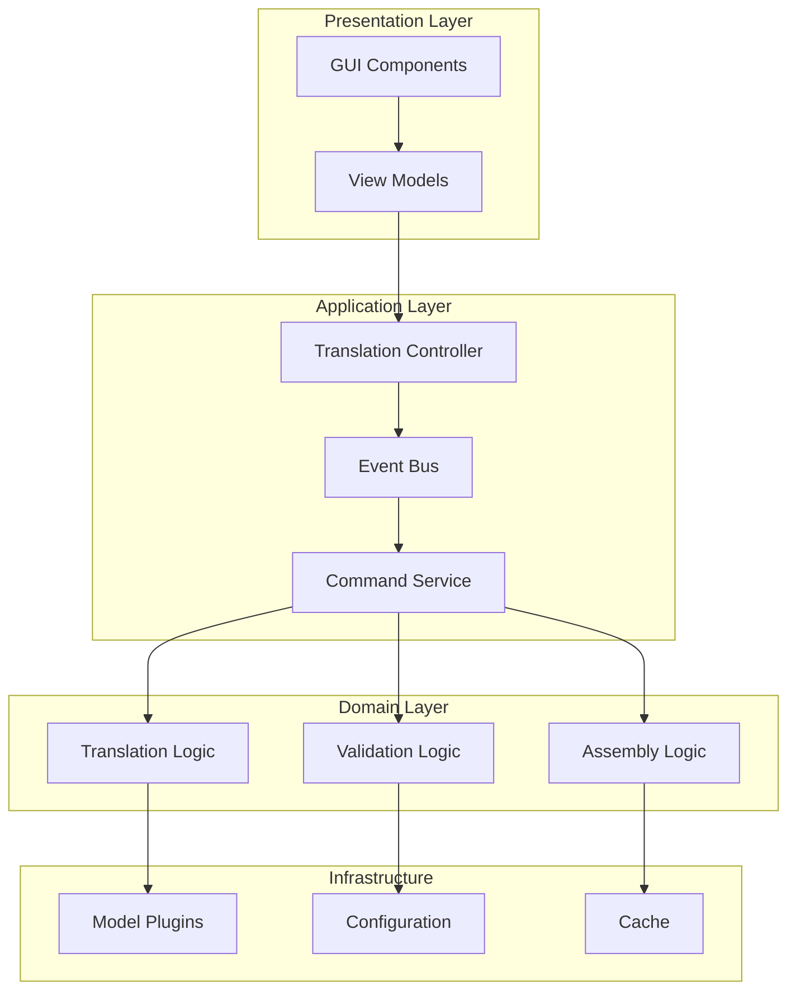
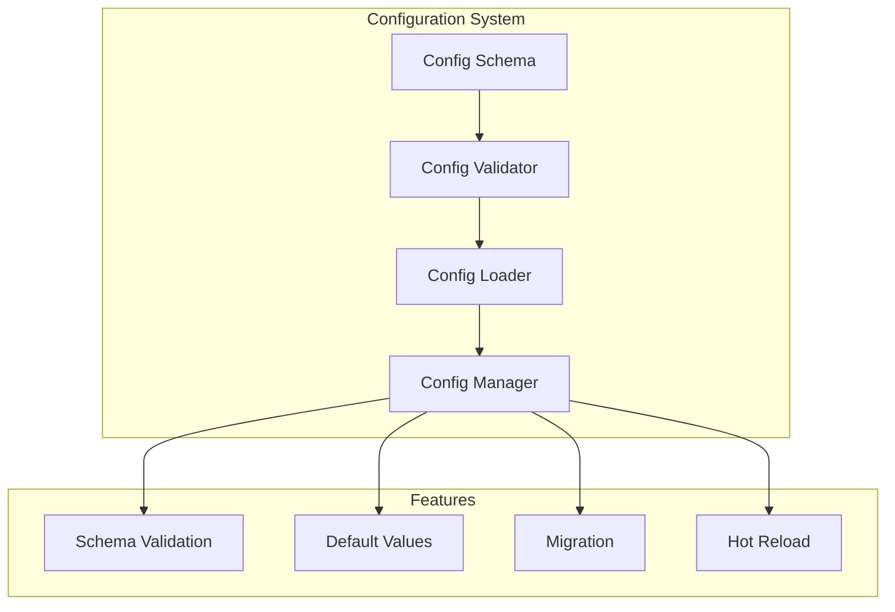
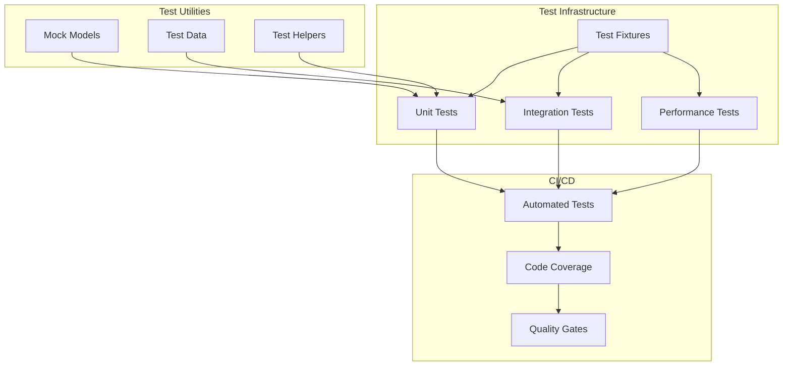

# Pseudocode Translator - Architecture Improvement Recommendations

## Executive Summary

This document provides comprehensive architecture improvement recommendations for the Pseudocode Translator project. Based on analysis of the current implementation, we've identified key areas for improvement that will enhance flexibility, maintainability, performance, and extensibility.

## Current Architecture Analysis

### Key Pain Points Identified

1. **Hard Model Dependency**: The system is tightly coupled to Qwen 7B model with no abstraction layer
2. **Code Duplication**: Significant duplication between `gui_worker.py` and `assembler.py`
3. **Missing Features**: No undefined variable validation, no automatic model downloading
4. **Limited Extensibility**: Adding new models requires code modifications
5. **Memory Inefficiency**: No streaming support for large translations
6. **Configuration Issues**: Runtime-only validation, no schema validation
7. **No Test Infrastructure**: Missing unit tests, integration tests, and test fixtures

## Proposed Architecture Improvements

### 1. Flexible Model Management System with Plugin Architecture

#### Design Overview

Create a plugin-based architecture that allows easy addition of new LLM models without modifying core code.



#### Key Components

**1. Abstract Model Interface (`model_interface.py`)**

```python
from abc import ABC, abstractmethod
from typing import Dict, Any, Optional, AsyncIterator
from dataclasses import dataclass

@dataclass
class ModelCapabilities:
    supports_streaming: bool
    max_context_length: int
    supports_function_calling: bool
    supports_system_prompts: bool

class AbstractLLMModel(ABC):
    """Base interface for all LLM models"""

    @abstractmethod
    async def initialize(self, config: Dict[str, Any]) -> None:
        """Initialize the model with configuration"""
        pass

    @abstractmethod
    async def generate(self, prompt: str, **kwargs) -> str:
        """Generate text from prompt"""
        pass

    @abstractmethod
    async def stream_generate(self, prompt: str, **kwargs) -> AsyncIterator[str]:
        """Stream generation for memory efficiency"""
        pass

    @abstractmethod
    def get_capabilities(self) -> ModelCapabilities:
        """Get model capabilities"""
        pass

    @abstractmethod
    async def health_check(self) -> bool:
        """Check if model is healthy and ready"""
        pass
```

**2. Model Registry (`model_registry.py`)**

```python
class ModelRegistry:
    """Registry for managing available models"""

    def register_model(self, name: str, model_class: Type[AbstractLLMModel]) -> None:
        """Register a new model implementation"""

    def get_model(self, name: str) -> AbstractLLMModel:
        """Get model instance by name"""

    def list_available_models(self) -> List[ModelInfo]:
        """List all registered models with their info"""
```

**3. Plugin Loader (`plugin_loader.py`)**

```python
class PluginLoader:
    """Dynamic plugin loading system"""

    def load_plugins_from_directory(self, plugin_dir: Path) -> None:
        """Load all model plugins from directory"""

    def validate_plugin(self, plugin_path: Path) -> bool:
        """Validate plugin structure and interface"""
```

### 2. Streaming Architecture for Memory Efficiency

#### Design Overview

Implement streaming support throughout the pipeline to handle large translations efficiently.



#### Key Components

**1. Streaming Translation Manager (`streaming_translator.py`)**

```python
class StreamingTranslationManager:
    """Handles streaming translation with backpressure"""

    async def translate_stream(
        self,
        input_stream: AsyncIterator[str],
        chunk_size: int = 1024
    ) -> AsyncIterator[TranslationChunk]:
        """Process input stream and yield translation chunks"""

    async def handle_backpressure(self) -> None:
        """Handle memory pressure by pausing/resuming"""
```

**2. Chunk Processor (`chunk_processor.py`)**

```python
@dataclass
class TranslationChunk:
    id: str
    content: str
    metadata: Dict[str, Any]
    position: int
    is_complete: bool

class ChunkProcessor:
    """Process translation in chunks"""

    def split_into_chunks(self, text: str, max_size: int) -> List[TranslationChunk]:
        """Smart chunking that respects code boundaries"""

    async def process_chunk(self, chunk: TranslationChunk) -> TranslationChunk:
        """Process individual chunk"""
```

### 3. Improved Separation of Concerns

#### Design Overview

Separate GUI concerns from core translation logic using event-driven architecture.



#### Key Components

**1. Event Bus (`event_bus.py`)**

```python
class EventBus:
    """Central event bus for decoupled communication"""

    def publish(self, event: Event) -> None:
        """Publish event to subscribers"""

    def subscribe(self, event_type: Type[Event], handler: Callable) -> None:
        """Subscribe to specific event type"""
```

**2. Translation Service (`translation_service.py`)**

```python
class TranslationService:
    """Core translation service without GUI dependencies"""

    def __init__(self, event_bus: EventBus):
        self.event_bus = event_bus

    async def translate(self, request: TranslationRequest) -> None:
        """Process translation and publish events"""
        # Publishes: TranslationStarted, TranslationProgress, TranslationCompleted
```

### 4. Configuration Validation and Management System

#### Design Overview

Implement a robust configuration system with schema validation and migration support.



#### Key Components

**1. Configuration Schema (`config_schema.py`)**

```python
from pydantic import BaseModel, Field, validator

class ModelConfig(BaseModel):
    """Model configuration with validation"""
    name: str = Field(..., min_length=1)
    path: Optional[Path] = None
    download_url: Optional[str] = None
    context_size: int = Field(2048, ge=512, le=32768)

    @validator('path')
    def validate_path_or_url(cls, v, values):
        """Ensure either path or download_url is provided"""

class TranslatorConfig(BaseModel):
    """Main configuration with nested schemas"""
    models: List[ModelConfig]
    translation: TranslationConfig
    performance: PerformanceConfig

    class Config:
        schema_extra = {
            "example": {...}  # Example configuration
        }
```

**2. Configuration Manager (`config_manager.py`)**

```python
class ConfigurationManager:
    """Manages configuration lifecycle"""

    def load_config(self, path: Path) -> TranslatorConfig:
        """Load and validate configuration"""

    def migrate_config(self, config: Dict, from_version: str) -> Dict:
        """Migrate configuration between versions"""

    def watch_config(self, callback: Callable) -> None:
        """Watch configuration file for changes"""
```

### 5. Comprehensive Testing Infrastructure

#### Design Overview

Create a complete testing framework with unit tests, integration tests, and fixtures.



#### Key Components

**1. Test Fixtures (`tests/fixtures.py`)**

```python
@pytest.fixture
def mock_llm_model():
    """Mock LLM model for testing"""

@pytest.fixture
def sample_pseudocode():
    """Sample pseudocode test cases"""

@pytest.fixture
async def translation_service():
    """Configured translation service for testing"""
```

**2. Test Base Classes (`tests/base.py`)**

```python
class TranslatorTestCase:
    """Base class for translator tests"""

    def assert_valid_python(self, code: str) -> None:
        """Assert generated code is valid Python"""

    def assert_translation_equivalent(self, instruction: str, code: str) -> None:
        """Assert translation matches instruction intent"""
```

### 6. Architectural Patterns and Design Decisions

#### Key Design Patterns

1. **Plugin Architecture**: For model extensibility
2. **Repository Pattern**: For data access abstraction
3. **Event-Driven Architecture**: For loose coupling
4. **Streaming/Reactive Pattern**: For memory efficiency
5. **Command Query Separation**: For clear interfaces

#### Technology Choices

1. **Async/Await**: For concurrent processing
2. **Pydantic**: For configuration validation
3. **pytest**: For testing framework
4. **asyncio**: For streaming support
5. **pluggy**: For plugin system

### 7. Implementation Priorities

#### Phase 1: Foundation (High Priority)

1. **Model Abstraction Layer**

   - Create abstract model interface
   - Implement model registry
   - Migrate existing Qwen implementation

2. **Configuration System**

   - Implement Pydantic schemas
   - Add validation layer
   - Create migration system

3. **Basic Testing Infrastructure**
   - Set up pytest framework
   - Create initial test fixtures
   - Add unit tests for core components

#### Phase 2: Core Improvements (Medium Priority)

1. **Plugin System**

   - Implement plugin loader
   - Create plugin template
   - Add CodeLlama plugin example

2. **Streaming Support**

   - Add streaming to model interface
   - Implement chunk processor
   - Update translation pipeline

3. **Event-Driven Architecture**
   - Implement event bus
   - Refactor GUI integration
   - Add progress events

#### Phase 3: Advanced Features (Lower Priority)

1. **Model Auto-Download**

   - Add download manager
   - Implement progress tracking
   - Add model verification

2. **Advanced Validation**

   - Implement undefined variable checker
   - Add type inference
   - Create validation plugins

3. **Performance Optimization**
   - Add response caching
   - Implement batch processing
   - Add metrics collection

### 8. Migration Strategy

#### Step 1: Parallel Implementation

- Build new components alongside existing code
- Maintain backward compatibility
- Use feature flags for gradual rollout

#### Step 2: Incremental Migration

- Migrate one component at a time
- Start with model abstraction
- Add comprehensive tests before migration

#### Step 3: Deprecation

- Mark old components as deprecated
- Provide migration guides
- Remove after stabilization period

## Trade-offs and Considerations

### Performance vs Flexibility

- Plugin system adds overhead but enables extensibility
- Streaming reduces memory but increases complexity
- Balance with configuration options

### Complexity vs Maintainability

- More abstraction layers increase initial complexity
- Long-term maintenance becomes easier
- Documentation and examples crucial

### Local-First Design

- All features work offline
- Optional cloud features (model downloads)
- Privacy-preserving architecture

## Conclusion

These architectural improvements will transform the Pseudocode Translator into a flexible, extensible, and maintainable system. The plugin architecture enables easy addition of new models, streaming support handles large translations efficiently, and the improved separation of concerns makes the system more testable and maintainable.

The phased implementation approach allows for gradual improvement while maintaining system stability. Each phase delivers tangible value while building toward the complete architectural vision.
